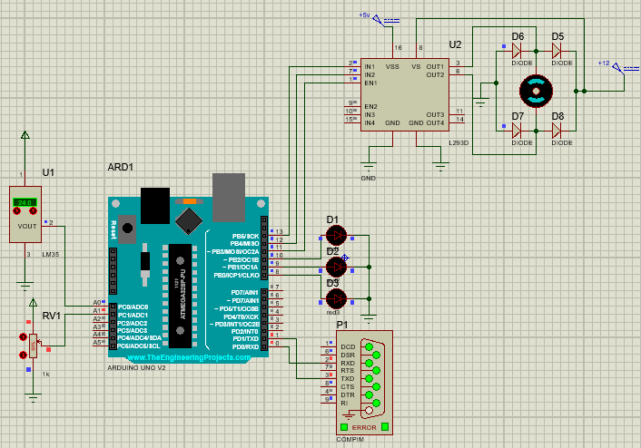
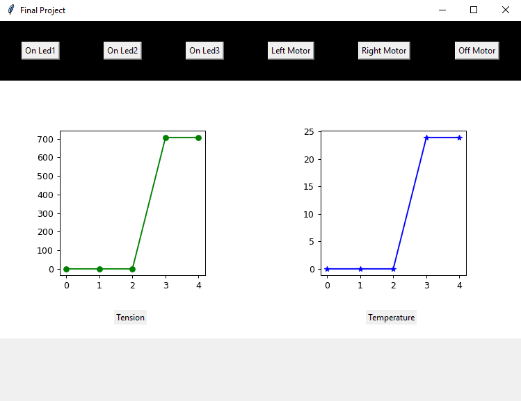

# Motor Controller

  
  

  

This is an application created to embedded systems discipline

The application display temperature and potenciometer values and manage a motor and leds

<h2>Funcionalitties</h2>
<ul>
  <li>On/Off leds</li>
  <li>Run clockwise motor</li>
  <li>Run counterclockwise motor</li>
  <li>Display temperature and potenciometer values in graphics</li>
</ul>
<h2>Technologies</h2>
<ul>
  <li>Matplotlib</li>
  <li>Arduino</li>
  <li>Serial Communication</li>
  <li>Tkinter</li>
  <li>Visual Studio</li>
</ul>
<h2>How to use</h2>
<ul>
  <li>Install a application to create virtual ports</li>
  <li>Install Arduino lib on Proteus</li>
  <li>Create a virtual env (optional)</li>
  <li>Use packet manager of your preference to install dependencies</li>
  <li>Open proteus project and start application</li>
  <li>Run gui.py</li>
</ul>

